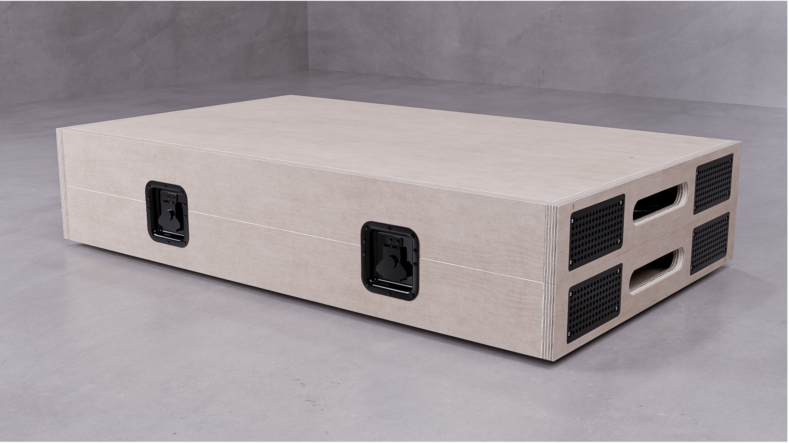
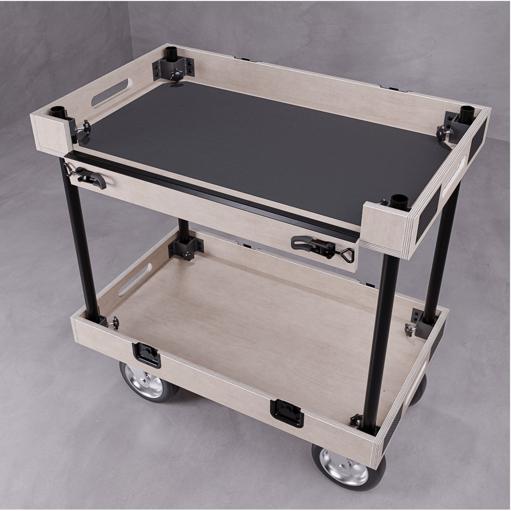
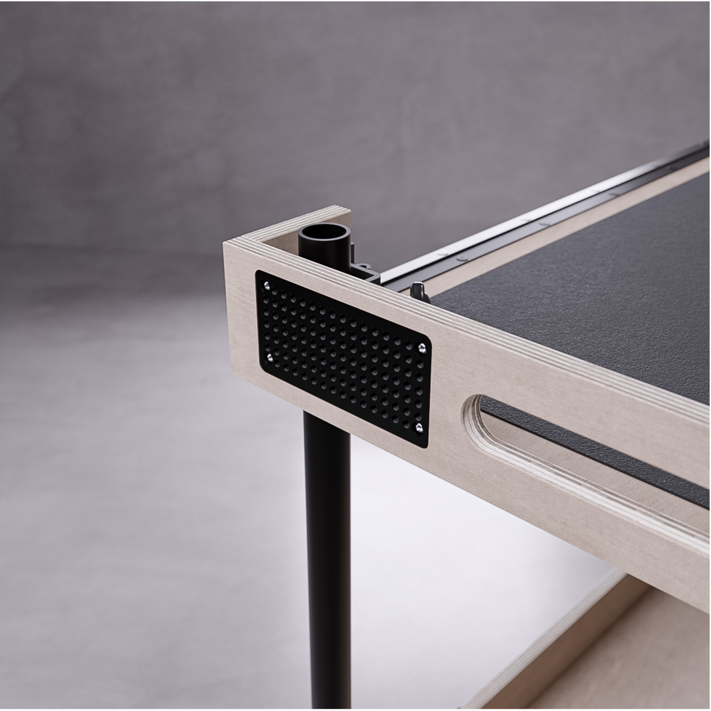
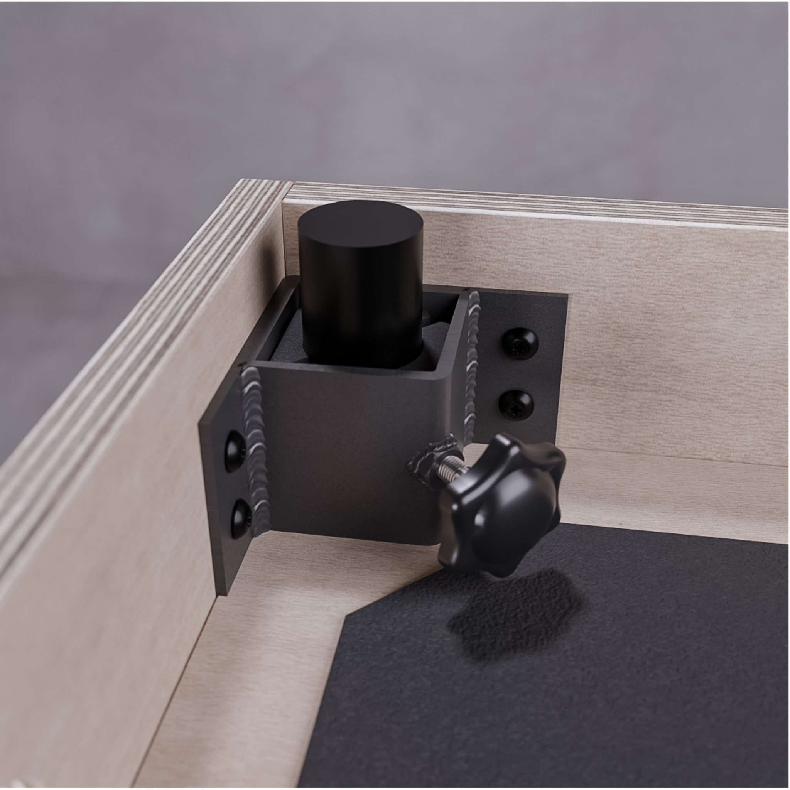
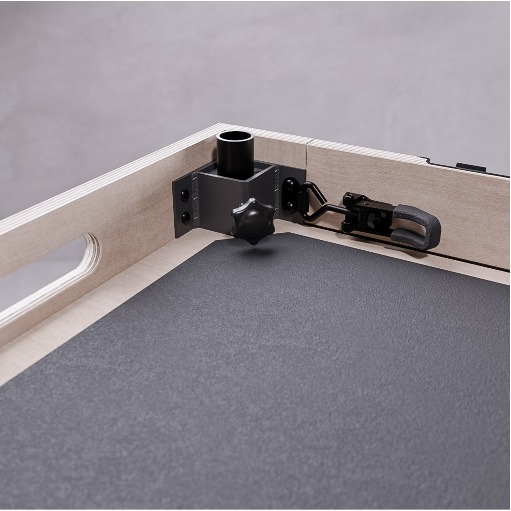

```
Status: Still Developing second visual Model.

ToDo: Model cross braces and middle shelf.
```


# Renderings:
(needs holes on top)




### Cheese Plates:
* Embedded 10mm
* 9mm 1/4 20 spacing
* Will add 3/8 & Arri 




### Leg Mounts
* Looked for inside corner hardware and couldn't find anything that worked for all 4 corners. This is what I came up with. I thought this would be possible to fabricate in house for a prototype. (I'm no engineer lol)
* Sheet steel & Squre tubing + reinforced 3d printed carbon inserts.


Idea for the front that folds down on a piano hinge:


### Caster Wheels:
* I modeled the wheels after generic Harbor Freight wheels because I found caster quick release plates on Alibaba if we wanted to do this real cheap. I plan on also modeling a dovetail solution similar to the compeditor carts.

(More Renerings soon)

# Reference Links

### Similar Products:

[ProAim Cart](https://www.proaim.com/collections/all-carts-workstations/products/proaim-victor-pro-video-production-camera-cart)

[Adicam Cart](https://www.bhphotovideo.com/c/product/1780401-REG/adicam_050_10blk_max_10_wheels_black.html)

[YaegerPro Cart](https://yaegerpro.com/products/yaegerpro-production-cart)

### Hardware:

[Caster Quick Release](https://www.alibaba.com/product-detail/Customized-Convenient-Removable-Quick-Changed-Plate_1601197017957.html?spm=a2700.galleryofferlist.normal_offer.d_title.7e0913a0X52bB9)

[Road Case Recessed Casters](https://www.diyroadcasesstore.com/categories/casters/edge-corner-casters.html)