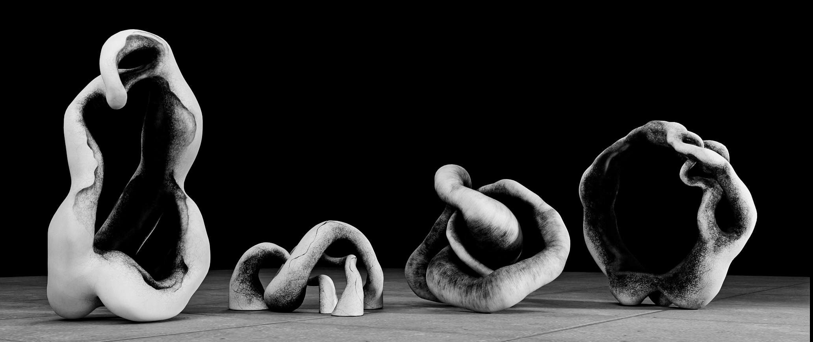

# Downloads
---
## Cleaned 3D Scans:

***heads up:*** These 3d files were *heavily* smoothed. If too much detail was lost, let me know and I will fix it! I will also smooth more if needed.

[SMOOTH HIGH-POLY STL](https://drive.google.com/drive/folders/1719vla8rzXfudZfVH-ntSnNk-PrCdaTS?usp=sharing)

* ~150k vertices means these stl files are smooth enough for printing without feeling the individual faces, I will also send much higher resolutions or raw scan data if needed.

[LOW-POLY STL](https://drive.google.com/drive/folders/1wYcnpOe5CGdUy8PTaemlhed2U3ZEt0-N?usp=sharing)

* ~10k vertices makes the low-poly stls good for experimenting with digital sculpting

[LOW-POLY GLB](https://drive.google.com/drive/folders/1wfBTxXk2_YvFqefS3LE5Pfi9ky42_m8I?usp=sharing)

* GLB is a popular 3d model format with image textures

[LOW-POLY USDZ](https://drive.google.com/drive/folders/1Ye7Qbowb7yJ12Bpl43ppiVBvwskVasnq?usp=sharing)

* Usdz is the format that lets you preview the models in AR on iphones