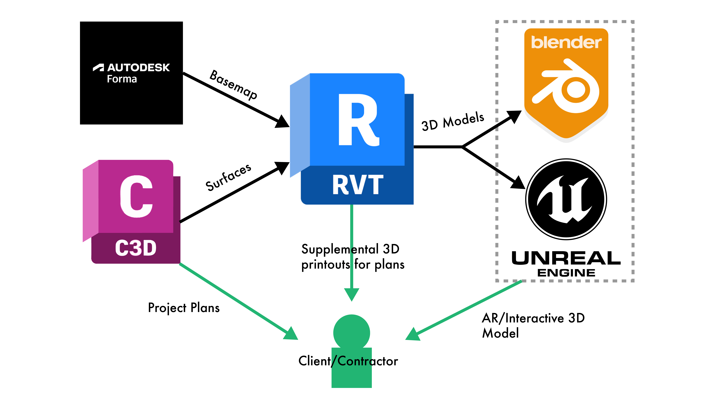
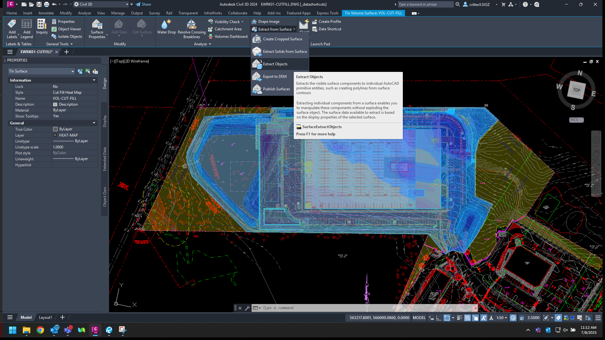
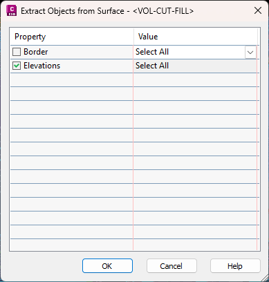

# Civil3D to Revit Workflow Guide v0.02

This tutorial demonstrates how to use Autodesk Revit to quickly generate supplemental 3D visuals for existing CAD drawings created in Civil 3D/AutoCAD. As an example, it walks through creating enhanced graphics for a Cut/Fill diagram.

---

### Workflow Overview:

### 1. Extract Basemap & Satellite Imagery from Autodesk Forma

- Create a project basemap in Forma and import it into Revit
    
- Apply stylization to the basemap in Revit using template files
    
- Prepare the map for integration with CAD data
    

### 2. Extract Surfaces from Civil 3D Project

- Isolate and extract terrain surfaces for use in Revit
    
- Import surfaces into Revit and convert them into Toposolids
    
- Position the surfaces on the basemap and apply textures
    

### 3. Create Multi-View Sheet in Revit

- Set up multiple views to clearly communicate the site context
    
- Lay out a sheet
    
- Export the model for use in other software such as Blender or Unreal Engine
    

---

# Part 1: Forma

### Setup:

To get started, visit the [Autodesk Forma Homepage](https://www.autodesk.com/products/forma/overview) and click **"Access your Forma Hub."**

Click **"Create New Site"** in the top-left corner. In the popup window, with your appropriate hub selected (or the default), press **"Create New Project."**

Name the project and press **Create.**

Type in the site address and use the bounding box to crop the desired basemap:  
_Example Project Address: 48 Orchard Place, Morganville, New Jersey 07751, United States_  

> **Note:** Extend the map well beyond the property boundary, as this cannot be extended later—only cropped.

Once the project loads, you should see the **Order Data** page:  

> _If not, access it via the globe icon on the left and select **"Browse Contextual Data."**_

**Add the following layers:**

- **Buildings** from Open City Model, OSM Buildings, or USA Structures
    
- **Satellite Image** via Mapbox
    
- **Terrain** via ESRI
    
- **Parcels** via Regrid _(may require payment)_
    

Click **"Create Site Limit"** on the right side of the map and trace the property boundary using parcel data:  

### Optional: 3D Vegetation

Install the **Thicket Extension** from the Extensions panel:

Create a new **"Tree Area"** to group multiple tree varieties:

Click **"+"** to add tree types.

> _To save time: `ThicketTrees.json` is in the assets folder. Import it from the top of the Thicket window._

Click **"Place"** to draw tree areas on the map:  

## Exporting

Install the **Revit Add-In** via the following tab:  

Back in Forma, press **"Send to Revit Add-In":**  

Open Revit and create a new project.

In the **Massing & Site** tab, click **"Load Proposal"**:  

> _Note: You must be logged into the **same Autodesk account** in both Revit and Forma._

Configure the import via **Options**:  

Click the **house icon** to open the 3D view:  

Change the visual style via the cube icon:  

Switch to **Consistent Colors**:  

## Cleanup

Hide the red parcel and building layers (Right-click → Hide in View → Elements).

> **Tip:** Use the blue light bulb icon to view hidden elements:  
> 

### Fixing Roads

Imported roads are _subdivisions_ of the basemap **Toposolid** and must be adjusted to appear properly:

1. **Select only the roads:**  
    Use **Modify > Filter** and select only **Subdivisions**  
    
    
    
2. **Change road color:**  
    Set the **Toposolid Type** to **Asphalt**
    
3. **Raise road elevation:**  
    Set **Sub-Divide Offset** to `1'` in the **Properties** panel  
    
    
    

Your basemap is now ready for site data:  

---

# Part 2: Exporting Site Data

With the basemap ready, export the following from Civil 3D:

1. **Cut/Fill Heatmap** (as 3D solids)
    
2. **Existing Surface** (survey data as a Toposolid)
    
3. **Proposed Surface** (as a second Toposolid)
    

## Cut/Fill Heatmap

Select the Cut/Fill surface → **Surface Tools > Extract from Surface > Extract Objects > Elevations**:  

  

Right-click the surface in the **Prospector Tab > Edit Surface Style**:  

## Exporting Surfaces

Because this Revit model is for visual supplement only, use the `WBLOCK` method instead of linking:

1. Select the surface and run `EXPLODE`
    
2. Run `WBLOCK` to export each surface as an individual `.dxf`
    

> _Note: `.dxf` offers better compatibility with software like Blender, Illustrator, or Unreal._

Make sure the **Existing Surface** is trimmed to the property boundary:  

You should now have 3 `.dxf` files:  

---

# Part 3: Revit

> _Tip: Group the basemap objects for easier visibility management._  
> 

### Importing & Aligning the Existing Surface

Go to **Insert > Import CAD**, choose the `.dxf` file, and set **Positioning** to **Auto - Center to Center**:  

Use the **Move Tool** to align the CAD surface with the basemap:  

  

### Creating a Toposolid from CAD

In **Massing & Site > Toposolid > Create from Import > Create from CAD**:  

  
  

Click **OK** to create the Toposolid.

Hide the CAD file (Right-click → Hide in View).

Select the Toposolid and set **Height Offset From Level** to `-3'` or as needed:  

Double-click the basemap terrain → **Modify > Excavate** → Select the new Toposolid → Finish:  

The property now contains accurate survey topography:  

## Building Views

Right-click and duplicate the default 3D view:  

### Custom Graphics Per View

Create a new view and isolate terrain for profile comparison:

Import the Cut/Fill Heatmap: **Insert > Import CAD (Center to Center)**

Align using **Offset From Workplane** in **Properties**, and **Move Tool**:  

Switch to _Front_ view via the navigation cube. Disable contour lines in **Visibility/Graphics Overrides**:  
  

### Section Box

Enable **Section Box** for scene cropping:  

Duplicate the Cut/Fill Heatmap to isolate _Cut_ and _Fill_ volumes:  

  

### Displace Tool

To make heatmaps appear in front of terrain **per view**, use the **Displace Tool**:  

  
  
  

### Additional CAD Overlays

Import full CAD project → Align using **Offset From Workplane** and **Move Tool**:  

Use **Query Tool** to delete unnecessary layers:  

  

## Assembling a Sheet

Right-click the **Sheets** tab in **Project Browser** → **New Sheet**:  

Import a title block or use the default:  

Drag views from **Project Browser** into the sheet. Adjust **View Scale** in **Properties**:  

Disable section box visibility via **Visibility/Graphics Overrides**:  

With customized views and layouts, you can now create compelling visuals to supplement CAD drawings:  

# Exporting to Blender/Twinmotion

Export as `.OBJ` or `.FBX`:  

> _OBJ tends to preserve materials and colors better._