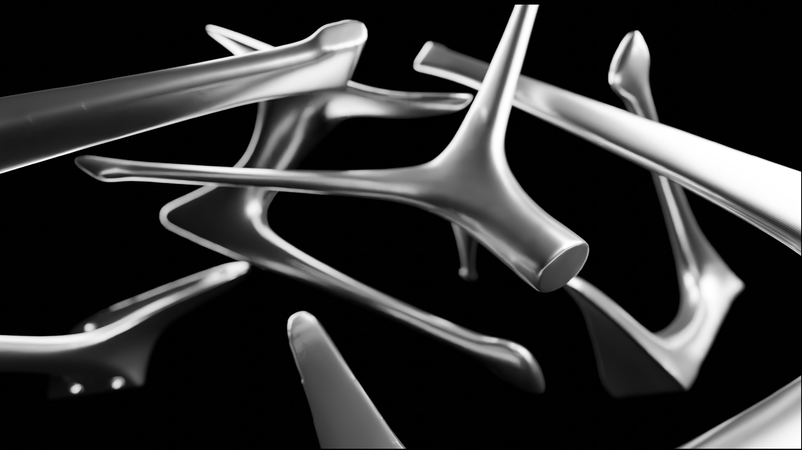

## Progress:
```
Completed manual smoothing & basic retopology. Concerned about detail loss from smoothing.
```
---

## Downloads

### 3D Scans:

RAW

[STL](https://drive.google.com/drive/folders/1LJ3j9SD9UarKPK0s0DP9xDI8srM3-ppk?usp=drive_link)

[OBJ](https://drive.google.com/drive/folders/1cwUpSfwgrkG7Xe-QI3xN6zVDc-S71rFd?usp=drive_link)

[AR](https://drive.google.com/drive/folders/1SrNIidMCjo4H__bAaGV2ZCPq1YG7GT4K?usp=drive_link) (Mesh auto-cleaned for AR demo)

CLEAN

[CLEAN](https://drive.google.com/drive/folders/1LirRC1e6CcUjzcerfVZBuUcc-nCCYp8e?usp=drive_link) (needs measurement and testing)

