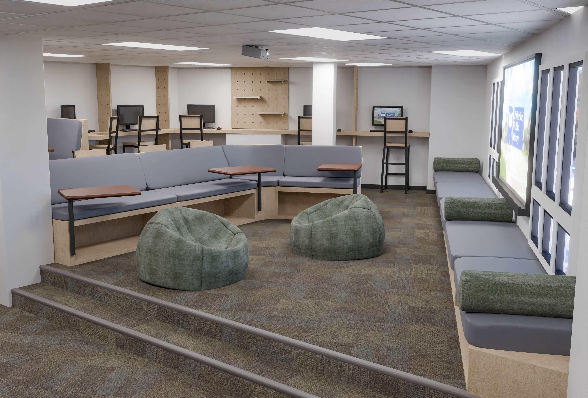

## Interactive 3D Websites  
I design interactive 3D websites that make it easy to showcase spaces, designs, or products online. These websites are a great way to provide an engaging experience for your audience, whether you’re an architect, museum curator, or business owner.  

## 360° Photography and Virtual Tours  
I create immersive, high-quality 360° photo tours to help bring your spaces to life. Whether it’s for real estate, museums, entertainment venues, or preservation projects, these tours offer an interactive way for people to experience your location from anywhere.  

## 3D Scanning
Using advanced 3D scanning tools, including LiDAR, I can capture detailed scans of objects, interiors, and exteriors. This is a great way to preserve items or spaces for historical records, recreation, or industrial use.

## 3D Rendering for Architecture and Design  
If you have an idea you’d like to see realized in 3D, I can create custom visualizations tailored to your needs. From artistic recreations to product prototypes, I enjoy working on a wide variety of projects.  I specialize in creating realistic 3D renderings for architectural and engineering projects. These renderings showcase designs with precision and creativity, helping bring your vision to life.  

## Drone Tours and Aerial Photography  
Whether it’s for real estate, events, or large-scale projects, I can help highlight the full scope and beauty of your location.  

# Questions?:

Fill out this form for questions or to request an estimate: 

Click here -> [Service Request Form](https://docs.google.com/forms/d/e/1FAIpQLSelYAIyILP6UOwDHyicCFY-RbbOHy3VGTS0BmADl1vXVZk61w/viewform?usp=sf_link)