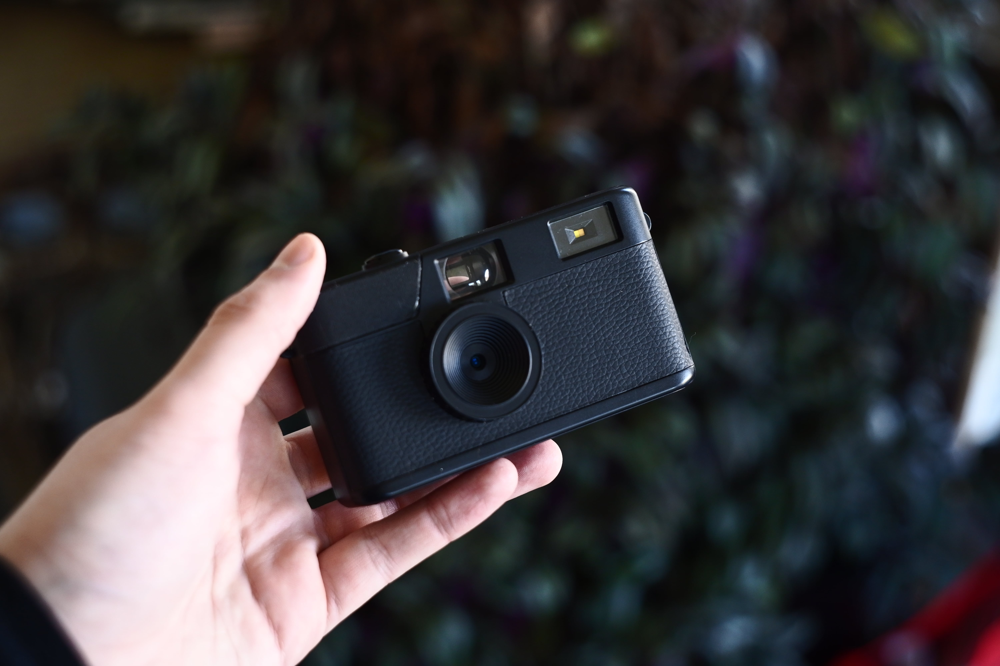
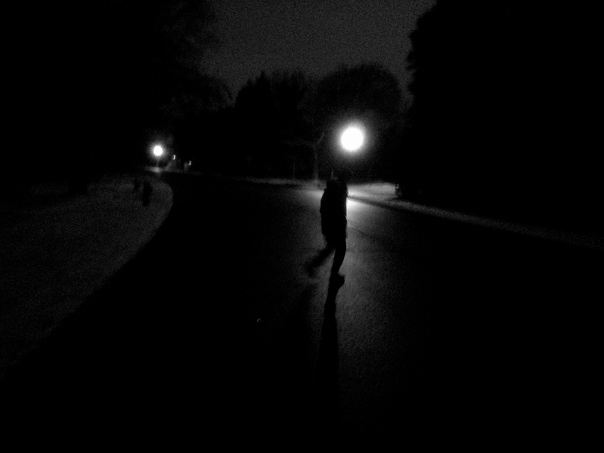

+++
author = "Chris Lyons"
title = "The Camp Snap 103"
date = "2025-01-31"
draft = true
description = "Messing around with the instagram camera"
tags = [
    "photography",
    "camera",
	    "tech"
	    ]
+++

As someone who refuses the title of photographer but won’t leave home without a camera, I fall into the niche (though growing?) category of point-and-shoot enthusiasts. I think this comes from how much I despise using a smartphone to take photos. There’s something about holding a (sometimes $1,000+) piece of glass by the corners that takes you out of the environment you’re trying to capture. This same awkard feeling has bled into holding up any digital camera that doesn't have a viewfinder: I still feel like I'm staring at a screen. While digital cameras without screens do exist, there’s an easier solution to this problem: buy a film camera.

Unfortunately, I have a chronic issue that prevents me from exploring that world: final boss syndrome. In certain video games, you collect items that can only be used once, so you save them for when you _really_ need them. I’m the person who reaches the final battle with an inventory full of single-use potions and defeats the boss without ever using them because I thought, _there will ALWAYS be a better time to do so._ This is also my experience with film photography (and instant cameras). I’d carry a disposable camera for months before finishing the roll—not to mention, I’ve never actually gotten any of them developed. I know this might be a matter of discipline, but honestly, I enjoy something right in between: Enter the Camp Snap Camera.

If you use Instagram and have even a passing interest in cameras, there’s a good chance you’ve been served a million ads for this thing. The first time I saw one, I opened their wepage, and since then, my feed has been flooded with ads to the point where even my friends started getting them—and sending them to me. I was clearly the target demographic.

### So what is it?

According to their website, the camera was designed for one incredibly niche reason: summer camp. Apparently, most summer camps in the U.S. don’t allow electronics of any kind, with the exception of disposable film cameras—or more specifically, _cameras without screens._ The couple who founded the company simply wanted their child to take more photos without worrying about proper exposure, so they invented a camera that captures the essence of a disposable camera experience but with a digital sensor inside. The camera’s popularity quickly expanded beyond its intended campers, promising a nostalgic, distraction-free way to take photos for adults too.

You’d think that sales pitch alone would have been enough to get me to spend the $65 to buy one, considering it checks a lot of my boxes. But the one thing holding me back was how aggressively I was being served ads. I kept wondering: _How much of my $65 is going toward manufacturing versus marketing?_

Upon closer inspection of the website’s product photos, I noticed that the front “lens” of the camera is merely a facade, hiding what looks like a cheap smartphone sensor behind a large piece of plastic. I wasn’t expecting anything spectacular, but I suspected this would be closer to the $20 children's cameras you can find on Amazon—which, ironically, have the added expense of screens. The camera has received almost universal praise from photographers who have reviewed it, but I suspect the Camp Snap team has been handing them out to YouTubers like candy on Halloween. Plus, in the eyes of a pro photographer, $65 is nothing—even for a novelty.

Luckily, I didn’t have to make the decision myself. Santa did it for me. All those ads to friends and family paid off because I received an all-black Camp Snap 103b for Christmas—and so did my siblings.

### My First Impressions

I wanted to take every photo on Christmas Day with the Camp Snap, so I quickly unboxed it. To no surprise, the camera felt like a toy you’d get in a Happy Meal. It was so light and cheap-feeling that I knew my gut instinct had been 100% correct. That being said, it was Christmas, and I was hoping the photo quality would make up for it.

The camera itself is simple enough. There’s only one button to operate everything. You hold it down until it clicks, at which point it functions as a shutter button. If you leave it alone for around 10 minutes, it automatically turns off. You can also take a photo and then hold the shutter button down to power it off manually. There’s a small slider to enable or disable the flash, though you can also just leave it on auto. A tiny LCD screen displays only the number of photos taken.

The design takes more inspiration from old rangefinders than disposable cameras, which might explain why it feels so cheap. If it looked more like a disposable, the weight and feel might have been more familiar.

Using the camera is fun but a little frustrating. The shutter has a noticeable delay when pressed, and the camera frequently turns on in my pocket or bag because of that single button. I was also surprised that, even without a screen, the battery life is mediocre. Yes, it will last days—maybe weeks if you’re not using it much—but if you’re on vacation and constantly turning it on, it could die mid-day without any indicator to warn you.
### Image Quality

To fully buy into the gimmick, I took photos all day and night without checking them. This was a mistake. The image quality is so bad that I wish I had known sooner so I could have taken the photos with my regular camera—or even my phone.

I won’t go too deep into the details, but the amount of digital noise and color artifacts is exactly what you’d expect from a very cheap smartphone sensor. Everything is aggressively over-sharpened, making it difficult to recover images after the fact.

### My Honest Conclusion

After using the camera for a month and a half, would I regret buying it if it hadn’t been a gift?

No. Surprisingly, I’ve found ways to make this thing work. First, I downloaded the black-and-white “filter” from Camp Snap’s website, which made a world of difference. A lot of what made the images look bad now looks kinda cool—the digital noise now resembles film grain. To fix the sharpness issue, I attached an adapter to thread a mist filter onto the camera to soften the images.

I’ve taken the camera to multiple concerts, where it’s a no-brainer to pass between friends (or even drunk strangers).

I’ve taken it skiing, where I’ve come to love it the most—I hate the awkward wide-angle look of action cameras, and this one works super well with mittens!

So far, my favorite part of using the camera is when it comes time to transfer photos. I connect it directly to my phone, usually right before bed, and relive the day’s photos for the first time. I know this feeling is all too familiar for film photographers, but there’s something nice about choosing _when_ you get to have that moment.

### Should You Buy One?

Right now, the number of photos displayed on the back of my camera is 827. That’s way more than I would have ever taken with my smartphone. That’s roughly 30 disposable cameras, which would cost far more than the Camp Snap. For me, it has absolutely been worth it.

Do I recommend you go out and buy one? Probably not. While I’ve found it to be a perfect companion for activities where I don’t want to carry a nice camera but also don’t want to use my phone, it’s still not for everyone. I mentioned each of my siblings also received one for Christmas, and I’d bet that some of their photo counts are still in the single digits.

It’s perfect if your kid is going to summer camp and you’re okay with crappy photo quality. Or, if you’re like me—desperate to ditch the smartphone but still want something that actually _feels_ like a camera.